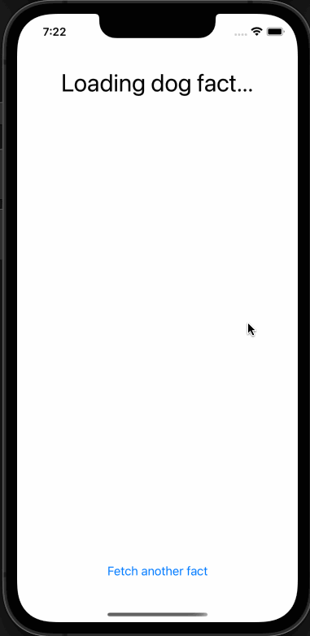

# Dog Facts App Article Series

Hello and Welcome! 👋

This is the base repository for the `DogFacts` app article series, where you can find a simple feature with the best coding practices that I introduced to my daily basis, all these on a very simple feature: Fetch random Dog 🐕 facts.

If you want to check them out, please visit them any feedback will be more than welcome! 🙌 and stay tuned 😉.

General reference:

- [Architecture Doc 🛠🏗](./docs/ARCHITECTURE/README.md)

## Articles:

### Taking control of my UIKit app Composition [Builder, Factory Methods, App's Entry Point]

**Xcode version:** 14.3

[release/article/decouple-UIKit-composition](https://github.com/wilbarrios/ios-decoupled-app/tree/release/article/decouple-UIKit-composition) In this repository you'll find:

- Completely removed the composition responsibility from our `ViewController`.
- **"Manually"** composed our *app's entry screen*.
- Created generic functions to construct Storyboard based screens.

This is the base repository for my [article](https://medium.com/@wil.barriost/taking-control-of-my-uikit-app-composition-builder-factory-methods-apps-entry-point-b692d235afa5).

### iOS Clean architecture? My way on a very simple feature [MVVM, Repository, URLSession, Swift]

**Xcode version:** 13.4.1

[release/article/decoupled-ios-app](https://github.com/wilbarrios/ios-decoupled-app/tree/release/article/decoupled-ios-app) In this repository you'll find:

- An implementation of **MVVM** design pattern, in a very basic way without any Reactive framework.
- A completely decoupled loading system for any source of data with a **Repository** approach.
- A reusable HTTP GET client based on Foundation's loading system **URLSession**.
- An API definition to model the API.
- And more importantly, we have created a decoupled feature that can be isolated, mocked, and tested on each layer.

This is the base repository for my [article](https://medium.com/@wil.barriost/ios-clean-architecture-my-way-on-a-very-simple-feature-mvvm-repository-urlsession-swift-678cfe4301f0),

## Result app

